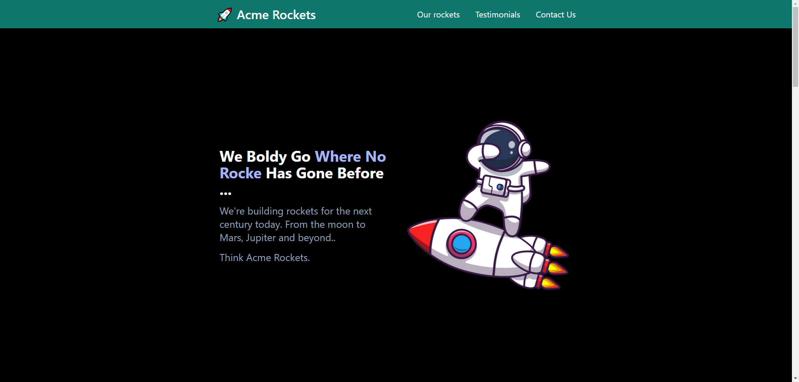

# tailwind css course

small website build with tailwind thanks to this [guy](https://www.youtube.com/@DaveGrayTeachesCode)


## Installation

Step-by-step instructions on how to get the development environment running.

1. Clone the repository:
    ```sh
    git clone https://github.com/yourusername/yourproject.git
    ```
2. Navigate to the project directory:
    ```sh
    cd yourproject
    ```
3. Install dependencies:
    ```sh
    npm install
    ```
   
4. How to use the project.

  ```sh
  npm start
   ```
